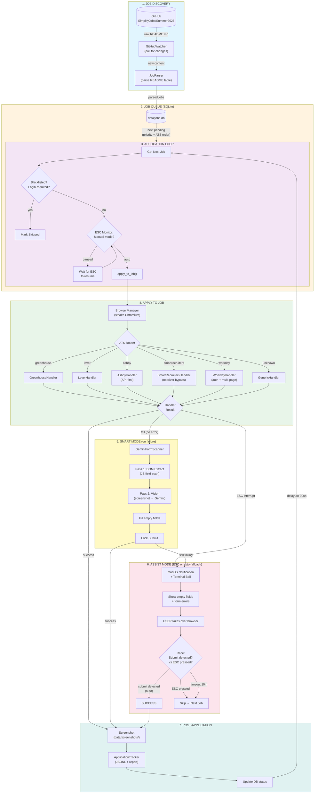
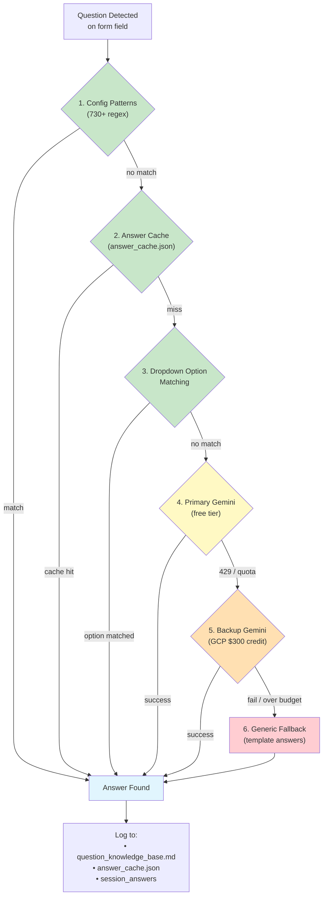
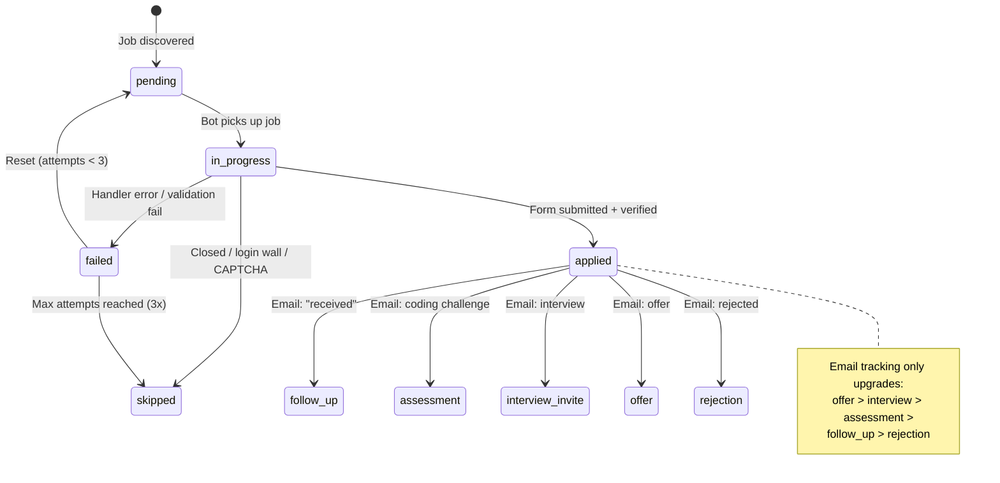
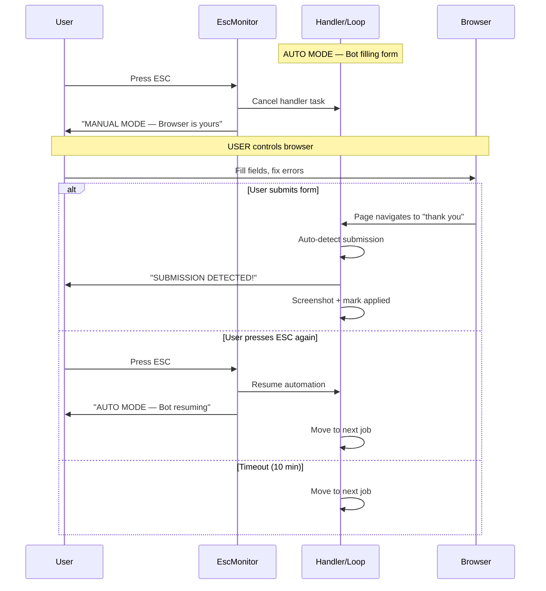
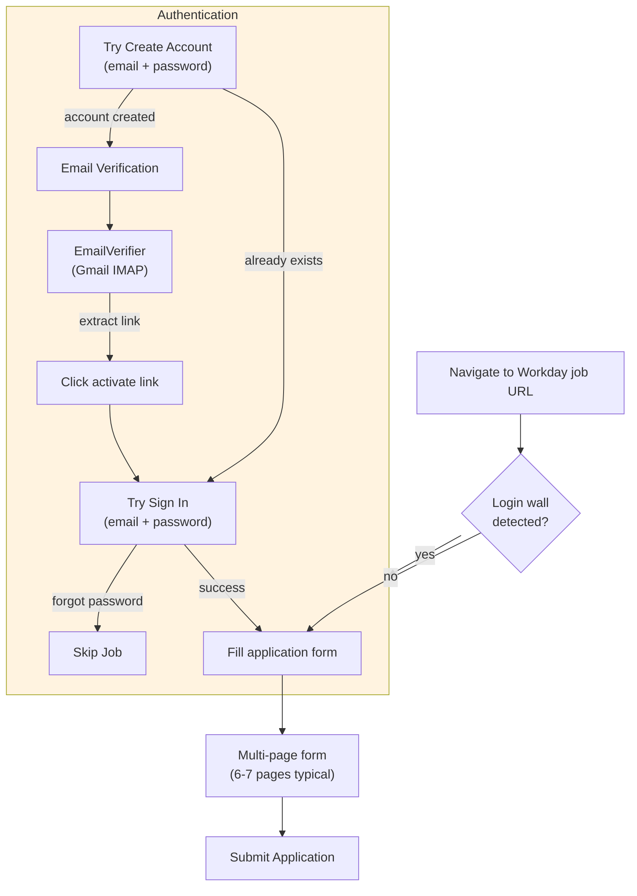
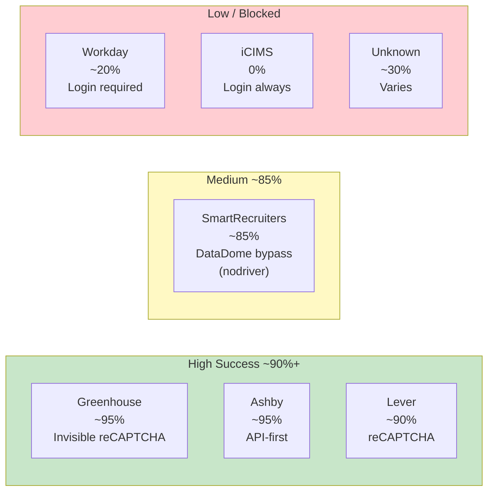
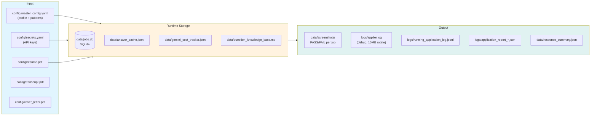
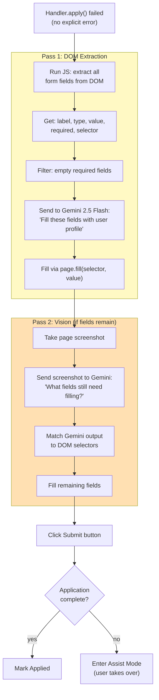

# Internship Auto-Applier — System Architecture

## Full System Overview

---

## Question Answering Cascade

---

## Job Status Lifecycle

---

## ESC Toggle Flow

---

## Workday Auth Flow

---

## ATS Handler Comparison

---

## Data Flow & File Map

---

## Smart Mode: Gemini Form Scanner

